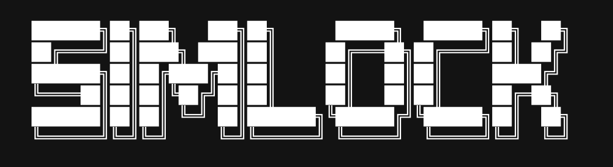
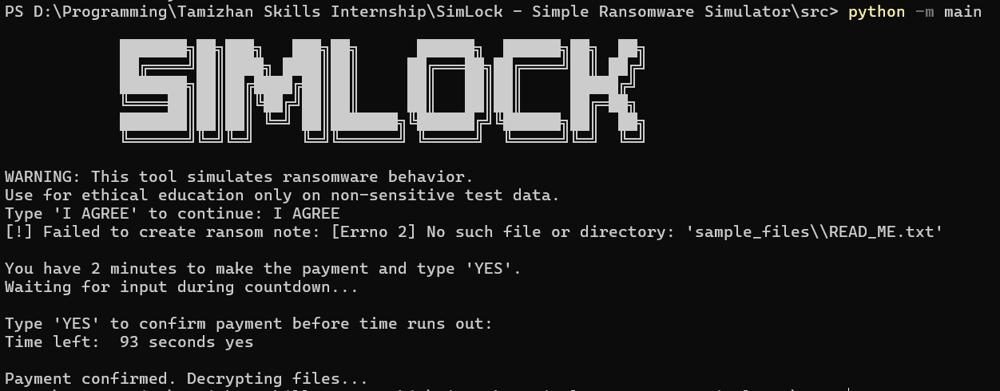

**SimLock** is a command-line tool that simulates basic ransomware behavior in a safe, educational environment. It encrypts files in a target directory using symmetric encryption, drops a ransom note, enforces a time lock, and requires the user to simulate a "payment" by typing `YES` before the timer expires. If the user fails, the files are deleted.

##  Disclaimer

This project is strictly for **educational and ethical purposes** only. Do **not** use this tool on sensitive data, production systems, or without proper authorization. The developers are **not responsible** for any misuse or damage.


##  Features

- Recursive encryption of all files in a target folder
- Symmetric encryption using `cryptography.Fernet`
- Simulated ransom note generation
- Time lock countdown with user input handling
- Automatic file deletion if "payment" is not received
- Full CLI-based interface with no external dependencies beyond `cryptography`


##  Requirements

- Python 3.7+
- cryptography

Install dependencies:

```bash
pip install -r requirements.txt
```


##  Usage

1. Clone the repository:

```bash
git clone https://github.com/yourusername/SimLock.git
cd SimLock
```

2. Add test files to `sample_files/`:

```bash
mkdir sample_files
echo "test" > sample_files/example.txt
```

3. Run the simulator:

```bash
python src/main.py
```

4. Follow the instructions:
   - A ransom note is created in `sample_files/`
   - You have 2 minutes to type `YES` to simulate payment
   - If confirmed in time, files are decrypted
   - Otherwise, all files are deleted

## Demo (Screenshot)



##  Project Structure

```
SimLock/
├── sample_files/                  
├── src/
│   ├── main.py                    
│   ├── key_manager.py             
│   ├── encryptor.py              
│   ├── decryptor.py               
│   ├── ransom_note.py             
│   ├── time_lock.py               
│   └── ethics.py                  
├── requirements.txt               
├── .gitignore                     
├── README.md                     
└── LICENSE
```


##  License

This project is licensed under the [MIT License](LICENSE.txt).